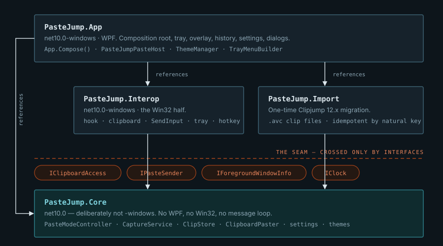
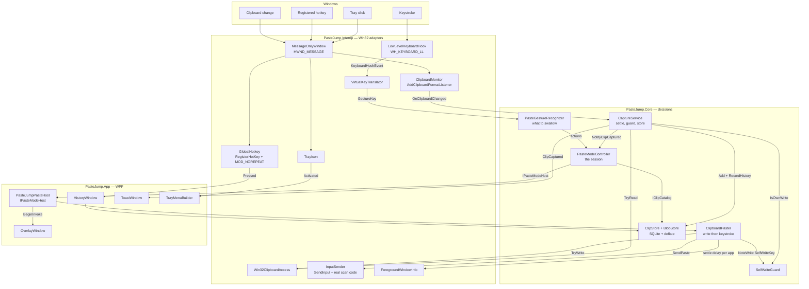
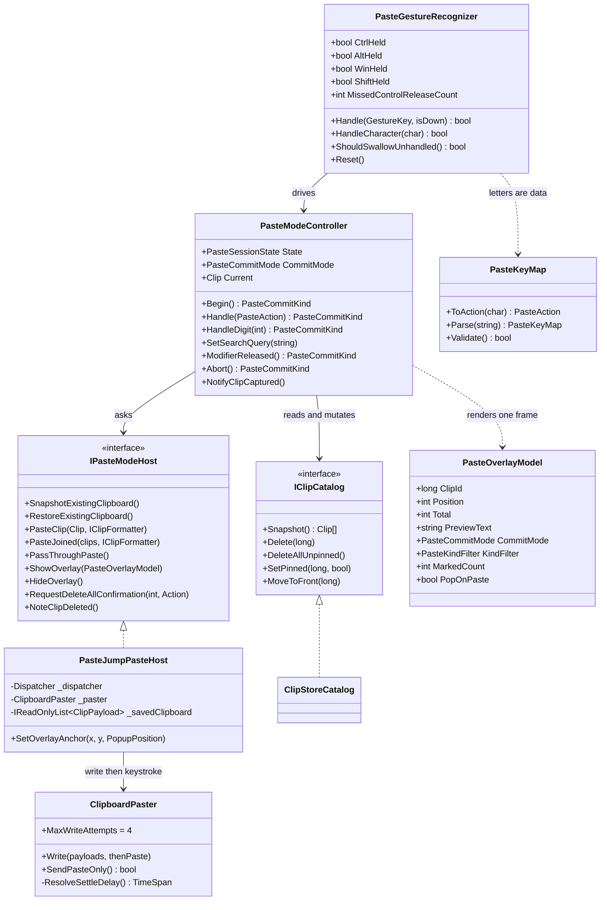
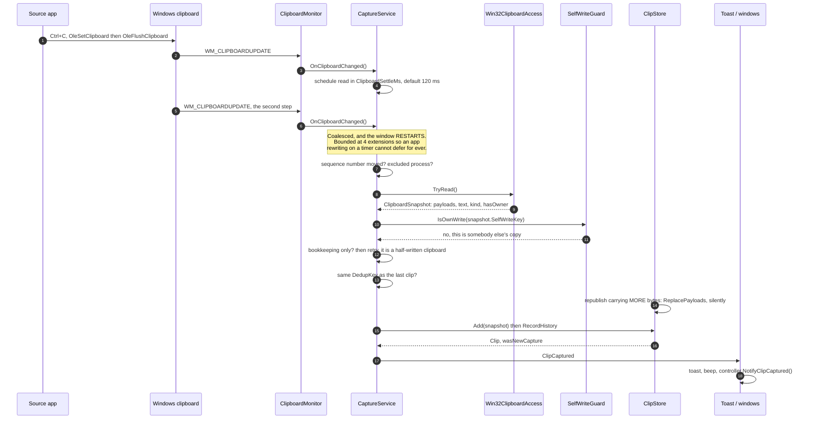
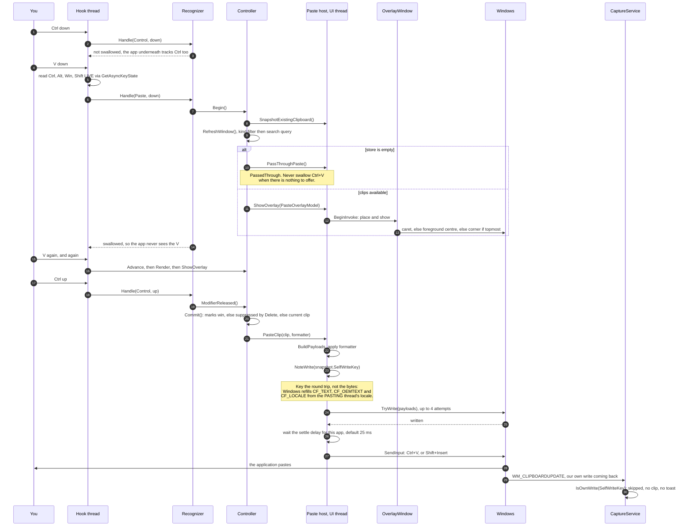
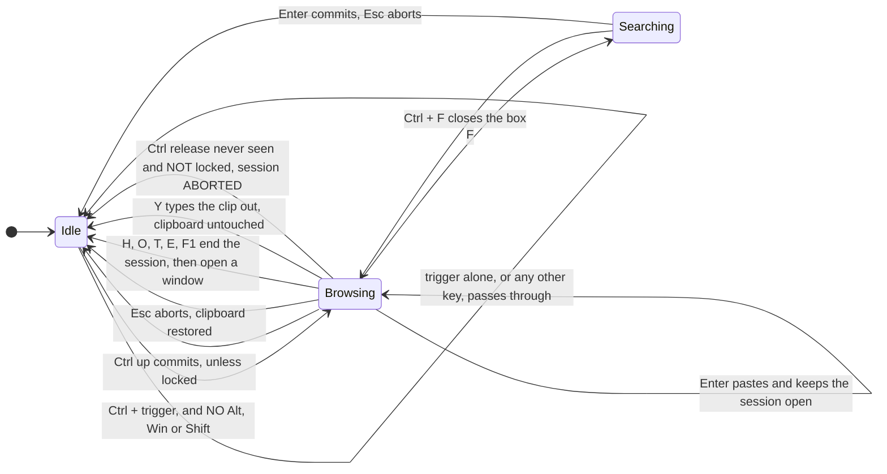
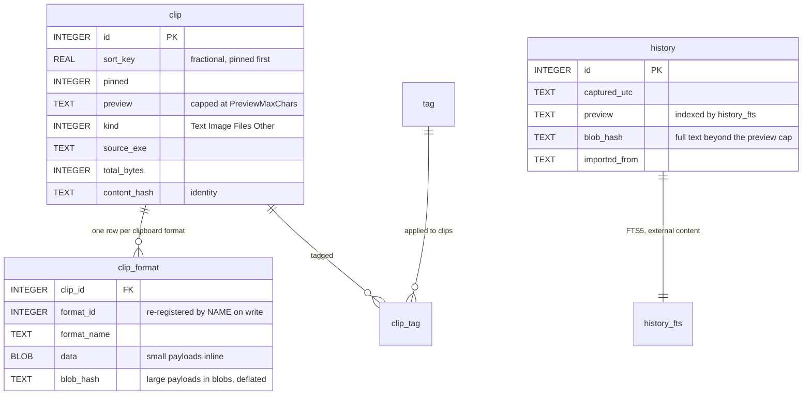
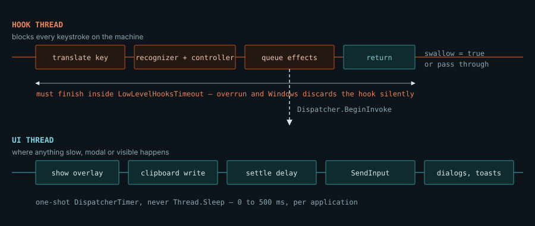

# PasteJump — architecture

Seven views of one machine: the layers, the components, the classes, the two sequences that matter, the
session state, the store, and the thread budget that shapes all of it.

> **There are two copies of this document and they must be edited together.** This Markdown is what GitHub
> renders (mermaid diagrams and all); `architecture.html` is the same content styled for the website, where it
> reads as [one designed page](https://lokeshgovindu.github.io/PasteJump/architecture.html), and the two
> hand-drawn figures in `docs/images/` are shared by both. Prose changes belong in both files in the same
> commit — unlike `docs/manual`, nothing generates one from the other.
>
> Design rationale lives in `CLAUDE.md` (the landmine sections) and `PLAN.md` (the state-machine spec). This
> document is the map, not the reasoning.

| | |
|---|---|
| Platform | .NET 10, WPF, `win-x64` |
| Projects | 4 |
| Tests | 1,071 Debug &middot; 1,069 Release |
| Version | `2026.1.0.n`, where *n* is the commit count |

**Contents**

1. [Premise: the one gesture](#premise-the-one-gesture)
2. [View 1 — layers and dependencies](#view-1--layers-and-dependencies)
3. [View 2 — components and event sources](#view-2--components-and-event-sources)
4. [View 3 — classes and contracts](#view-3--classes-and-contracts)
5. [View 4 — sequence: a copy becomes a clip](#view-4--sequence-a-copy-becomes-a-clip)
6. [View 5 — sequence: the gesture, end to end](#view-5--sequence-the-gesture-end-to-end)
7. [View 6 — state: session and commit mode](#view-6--state-session-and-commit-mode)
8. [View 7 — data: the store and three identities](#view-7--data-the-store-and-three-identities)
9. [Constraint: two threads, one deadline](#constraint-two-threads-one-deadline)
10. [Case study: the loop that closed wrong](#case-study-the-loop-that-closed-wrong)

---

## Premise: the one gesture

Hold <kbd>Ctrl</kbd>, tap <kbd>V</kbd>, let go. Every tap steps one clip further back through the stack, the
overlay follows under your cursor, and releasing <kbd>Ctrl</kbd> pastes whatever is showing. No window to
click, no mouse, no focus change. That gesture is the product, and three of its properties dictate the entire
architecture.

**The keyboard hook is machine-wide and on a deadline.** A `WH_KEYBOARD_LL` callback blocks every keystroke on
the computer until it returns, and Windows silently discards a hook that outlives `LowLevelHooksTimeout` —
leaving an app that looks healthy and has gone deaf. So nothing in the callback sleeps, prompts, parses or
draws; it decides, queues, and returns.

**Swallowing a keystroke takes it away from everyone.** With no session open, exactly one chord is consumed —
`Ctrl` plus the trigger — and nothing else, swept over all 256 virtual keys in every modifier state by
`IdleKeyboardTests`. With a session open the gesture owns the keyboard *except* Alt and Win chords, which stay
with the shell so `Alt+Tab` is always the way out.

**An empty store must not break Ctrl+V.** The hook swallows the chord to build the gesture, so a store with
nothing in it hands the keystroke straight back as a native paste (`PasteCommitKind.PassedThrough`). Silently
breaking Ctrl+V system-wide is the worst thing this application could do.

> **The rule that follows from all three.** `PasteJump.Core` references neither WPF nor Win32 and never needs a
> message loop. Win32 access is expressed as interfaces in `Core/Abstractions` and implemented in `Interop`.
> Anything that lands somewhere untestable gets moved, not covered by a UI test — which is why the capture
> service and the whole state machine are plain classes with 997 tests around them.

---

## View 1 — layers and dependencies

Dependencies point one way only. `Core` is the floor: it knows about clips, sessions and settings, and nothing
about windows or the operating system. Everything the OS provides arrives through four small interfaces, which
is also what lets tests drive the machine with a fake clipboard and no keyboard at all.

*Dependencies point down, never up. Interop implements what Core declares, so the same state machine runs
against a real clipboard in the app and a scripted one in tests. Build output lands in `artifacts/`, never
under `src/`.*

| Project | Framework | Holds |
|---|---|---|
| `PasteJump.Core` | `net10.0` | Domain logic. The state machine, capture, the store, settings, themes, formatters. |
| `PasteJump.Interop` | `net10.0-windows` | Win32 implementations of Core's abstractions, plus the hook, tray, hotkey and message-only window. |
| `PasteJump.Import` | `net10.0` | One-time Clipjump 12.x history migration. |
| `PasteJump.App` | `net10.0-windows` | WPF. The composition root and every window. |

---

## View 2 — components and event sources

PasteJump has no main window. Everything starts from one of four operating-system events, and `App.Compose()`
wires the objects that handle them by hand — about a dozen with fixed lifetimes, so a DI container would add
indirection and remove nothing.

**Two independent paths, and that asymmetry is diagnostic.** Capture rides `WM_CLIPBOARDUPDATE`, which no other
process's hook can suppress; the gesture rides the keyboard hook, which any hook earlier in the chain can. When
copying works and pasting does not, a rival clipboard manager eating the injected keystroke is the first suspect
— hence the configurable `PasteKeystroke`.

---

## View 3 — classes and contracts

The gesture is split in two on purpose. `PasteGestureRecognizer` answers only *"is this keystroke mine, and
what does it mean"*; `PasteModeController` owns the session — the window of clips, the cursor, the commit mode,
the marks — and performs no side effect itself. Everything it wants doing goes through `IPasteModeHost`, which
is what makes a paste testable without a clipboard.

**Nothing in the left column touches Windows.** `PasteOverlayModel` is immutable and carries `ClipId` because
`Position` is a coordinate in the *filtered* window — resolving a clip by position once drew the wrong image
when a kind filter was on.

### Where the abstractions bite

| Seam | Implemented by | Why it exists |
|---|---|---|
| `IClipboardAccess` | `Win32ClipboardAccess` | Reads every format in one pass, with a *bounded* retry (~620 ms). The original spun on `OpenClipboard` forever, turning another app's misbehaviour into a hang. |
| `IPasteSender` | `InputSender` | `SendInput` with a real scan code and our own `dwExtraInfo` signature — that signature is how the hook ignores *our* injection without ignoring RDP, VMs or macro keyboards. |
| `IForegroundWindowInfo` | `ForegroundWindowInfo` | Names the window being pasted into, so the settle delay can be per application and the ignore list can be checked *before* reading a password manager's clipboard. |
| `IClipCatalog` | `ClipStoreCatalog` | Keeps "delete all unpinned" as one rule in the store rather than restated by whoever draws the dialog. |
| `IPasteModeHost` | `PasteJumpPasteHost` | Every side effect of the state machine, all of it queued onto the Dispatcher — the reason the controller can run inside a keyboard hook at all. |

---

## View 4 — sequence: a copy becomes a clip

An OLE writer announces its data object and renders it afterwards, so a single Ctrl+C raises two or more
`WM_CLIPBOARDUPDATE` messages with different sequence numbers — and a read landing between them sees eight
bytes of bookkeeping and no content. Every guard below exists because one of those readings was once stored as
a clip.

**The settle window restarts rather than expiring.** A fixed window measured from the first notification was the
first attempt and produced a spurious "same as the last copy" toast whenever the second step landed just after
it. 120 ms was measured, not chosen: a WinForms `SetImage` holds the clipboard locked for ~50 ms and its
`CF_DIB` first reads at 51 ms.

### Every guard on the way in

| Guard | Budget | What it prevents |
|---|---|---|
| Settle window, restarting | 120 ms × 4 | One copy stored as two clips, or announced as a repeat of itself. |
| Sequence number unchanged | — | Paying to open the clipboard for a duplicate notification. |
| Excluded process, checked *first* | — | Pulling a password manager's clipboard into memory before deciding to discard it. |
| Bookkeeping-only payloads | 2 retries, 350 ms | An 8-byte `DataObject` stored as a `[binary]` clip — and, worse, promoting an unrelated old blob to the front of the stack. |
| `IsOwnWrite(SelfWriteKey)` | 5 s TTL | A paste being captured straight back as a new clip. Content-addressed, so there is no timing race. |
| `IsEchoOfOwnWrite` | 1 s | The *second* notification for one paste falling through to the duplicate branch, which announces itself. |
| Owner is null | — | An app flushing its formats as it closes reading as a fresh copy. Only ownership tells that from a repeat. |
| `RedundantImageFormats.Prune` | ~⅔ of bytes | Keeping the same pixels three times as `CF_DIB`, `CF_DIBV5` and `System.Drawing.Bitmap`. |

---

## View 5 — sequence: the gesture, end to end

This is the whole product in one diagram. Note where the work happens: the hook thread decides and returns, and
every consequence — the overlay, the clipboard write, the keystroke — runs on the UI thread through
`Dispatcher.BeginInvoke`. Note also the last two messages: our own paste comes back round as a clipboard change,
and the capture path has to recognise it. That return edge is where the bug in the case study lived.

**Never send the keystroke unless the write succeeded.** Clipboard writes genuinely fail — it is a machine-wide
lock — and a Ctrl+V after a failed write pastes whatever was there before, which looks exactly like PasteJump
choosing the wrong clip. That ordering lives in `Core` precisely so it can be tested.

### What releasing Ctrl can mean

The commit is not one branch. Marks beat the cursor, a `Delete` during the session suppresses the paste
entirely, and the `X` cycle can arm something destructive — which is why the only irreversible outcome asks
first, and asks *asynchronously*, because a modal dialog inside the hook would block every keystroke on the
machine.

| `PasteCommitKind` | Reached when | What the user sees |
|---|---|---|
| `Pasted` | Mode is Paste and a clip or a set of marks exists | The clip arrives; with Shift held it is also deleted ("pop"). |
| `PassedThrough` | Empty store, emptied window, or every mark deleted | A native Ctrl+V. Nothing of ours happened. |
| `Cancelled` | Esc, mode is Cancel, or `Delete` was pressed this session | Clipboard restored, nothing pasted. |
| `Deleted` | Mode is Delete | Current clip gone, clipboard restored. |
| `DeleteAllRequested` | Mode is DeleteAll | A confirmation, later, on the UI thread. *Nothing has been deleted yet.* |
| `PushedToClipboard` | `S` | Clip is on the clipboard; no keystroke sent. |
| `None` | Stepping, searching, pinning, marking, deleting one clip | Session stays open. |

---

## View 6 — state: session and commit mode

In `Browsing`, holding Ctrl is what keeps the session alive and releasing it commits. In `Searching` that would
be unusable — you need both hands to type — so releasing Ctrl does nothing at all and the session ends
explicitly with Enter or Escape. While the search box is up, **no letter and no digit is an action**: the arrows
are the only way to step, because they are the one pair that can never be part of a query.

**`L` generalises that freedom to browsing.** A locked session is still `Browsing` - the lock is a flag rather
than a fourth state, since search and lock are independent - but `RequiresModifier` is false, so the Ctrl release
commits nothing and every key goes on acting. One property answers it for all four callers that ask: the commit,
the action gate, the missed-release reconciliation and the health watchdog. Unlocking is refused unless Ctrl is
held, or the session could be left neither locked nor held open, accepting no key but Escape while swallowing
every one of them.

**Anything that opens a window must end the session first.** `F1` once did not, so the key card appeared over a
live overlay that went on swallowing the very keys it was explaining. The last edge is the watchdog: a missed
Ctrl-up is aborted rather than committed, because releasing Ctrl is what asks for a paste and here we do not
know that the user did.

The `X` cycle runs *Paste → Cancel → Delete → DeleteAll → Cancel* and never returns to Paste — deliberate
parity with the original, since a destructive cycle that looped back through "paste" would make an over-eager
keypress paste something you were trying to delete. The kind filter, by contrast, *does* wrap: nothing there is
destructive, so getting back to seeing everything must not cost three more taps.

---

## View 7 — data: the store and three identities

Immutable ids plus a fractional `sort_key`, so repositioning a pinned clip is one `UPDATE` — in the original it
was three `FileMove` calls per clip across parallel directories. The stack and the archive are separate tables
on purpose: a clip is a thing to paste and gets evicted; a history row is a record of when something was copied
and gets pruned by age.

**Format ids are not durable.** Ids from `RegisterClipboardFormat` are stable only for the Windows session, so a
payload stores the *name* and is re-registered on write. Persisting the number alone would attach today's bytes
to an unrelated format tomorrow.

### Three hashes that answer three different questions

| Key | Question | Covers | Consequence of getting it wrong |
|---|---|---|---|
| `ContentHash` | Is this the same clip? | Every format's id, name and bytes. | It is a stored column and the lookup for enrichment. Too loose and two clips merge. |
| `DedupKey` | Did the user copy this again? | Trimmed text alone for text clips; the content hash otherwise. | Word and Excel stamp their rich formats with generator ids, so a bytes-exact key never fires and the stack fills with apparent duplicates. |
| `SelfWriteKey` | Is this clipboard *ours*? | Only the payloads Windows does not refill for itself. | Too tight and PasteJump captures its own paste as a new clip — see the case study. |

---

## Constraint: two threads, one deadline

Read this figure as the reason for a dozen decisions elsewhere: why the trigger key and the letter map are
parsed once per settings change rather than per keystroke, why the delete-all prompt is a request rather than a
question, and why a `Console.Beep` — which blocks until the tone finishes — goes to the thread pool.

**The hook decides; the Dispatcher does.** A watchdog on a 250 ms timer covers the case where Windows drops the
hook anyway — and it cannot ask `IsInstalled`, because a discarded hook leaves that reporting `true` for ever.
It reasons from evidence instead: has anything been heard since Ctrl went down, and is a session still open
while Ctrl is physically up.

---

## Case study: the loop that closed wrong

Reported 2026-08-21, fixed the same morning. *"I pressed Ctrl+V in Edge and I saw the paste overlay, and
immediately it displayed copy overlay also."*

Not a notification fault and nothing to do with Edge. Look at the last two messages of
[View 5](#view-5--sequence-the-gesture-end-to-end): a paste comes back as a clipboard change, and it was not
recognised as ours — so it was stored as a brand new clip and announced, exactly like any copy.

The live logs said so in one reading. `logs\gesture.log` has the commit (`Ctrl up ... fg=msedge.exe` at
07:55:37.305) and `logs\capture.log` has the read 135 ms later — `STORED clip 3699 (new=True)`, where every
later paste of the same clip said `skipped: this is our own write`.

### The one byte

Two clips in the store held the same 66 characters, the same four formats and the same 2,044 bytes. They
differed in a single byte pair.

| Clip | `CF_LOCALE` | |
|---|---|---|
| 3698, as captured | `09 40 00 00` | 0x4009 — English (India), the layout the text was copied under. |
| 3699, as read back | `09 04 00 00` | 0x0409 — English (US), what Windows synthesised when it was pasted. |

**A clipboard write does not read back as what was written.** The writer deliberately drops `CF_TEXT`,
`CF_OEMTEXT` and `CF_LOCALE` when `CF_UNICODETEXT` is present, because a stale ANSI rendering captured under
another codepage can contradict the Unicode beside it and whichever the target app prefers decides what the user
gets. Windows then regenerates all three — *from the pasting thread's locale, not the copying application's*. So
the round trip is not the identity, and `ContentHash`, which covers every format's bytes, could not match it.

> **Why it survived so long.** It is self-limiting per clip. The recaptured twin carries the *synthesised*
> locale, so it is a fixed point and every later paste of that twin is recognised correctly. The log therefore
> reads like an intermittent fault — stored once, skipped twice — and a bug that stops reproducing on the second
> attempt is a bug that gets dismissed. It reappears for each newly captured clip, for ever.

Measured footprint on the reporting machine: **347 clips carry 0x4009 and 228 carry 0x0409**, and eight of the
ten largest same-text clip groups differ *only* in that byte. Those groups are paste-recaptures, not repeat
copies — one duplicate clip and one history row per first paste, with the browse position reset each time.

### The fix

1. **Separate the two questions that shared one hash.** `ContentHash` still identifies a clip and is untouched,
   since those bytes really do differ. `SelfWriteKey` identifies a round trip: the same hash over the payloads
   Windows does not refill. Where nothing is dropped it *is* `ContentHash`, so images, file lists and every
   existing store are unaffected. — `src/PasteJump.Core/Model/ClipboardSnapshot.cs`
2. **Put the rule in Core, once.** `SynthesisedTextFormats.DropDerived` is now called by both the write filter
   and the identity key — one list, not two that can disagree, which is precisely this bug's shape. —
   `src/PasteJump.Core/Model/SynthesisedTextFormats.cs`
3. **Refuse to canonicalise into nothing.** A clip holding only `CF_TEXT` keeps it: an empty payload set would
   identify every such clip as the same one, and a paste would suppress the capture of an unrelated copy.
4. **Prove it can fail.** Ten tests, including the reported case with the measured bytes. Against a build that
   keys on the content hash, three of them fail. —
   `tests/PasteJump.Core.Tests/SynthesisedTextFormatsTests.cs`

> **The transferable part.** Three instruments answered this and none of them was reasoning: the gesture log
> gave the commit, the capture log gave the read, and *the store gave the cause*. When a capture question comes
> up again, query the database early — a format list and four bytes settled in minutes what an afternoon of
> plausible theories about Edge would not have.

---

PasteJump — keyboard-driven multiple clipboards for Windows, a ground-up reimplementation of
[Clipjump](https://github.com/aviaryan/Clipjump) from observed behaviour. Detail lives in `CLAUDE.md` (the
landmine sections), `PLAN.md` (design and the state-machine spec) and `TASKS.md` (what is open).
