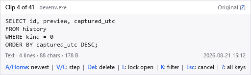

<!-- Generated from docs/help/overview.html by tools/generate-markdown-help.py. Do not edit. -->

[Manual index](README.md)

# PasteJump

**A keyboard-driven multiple-clipboard manager for Windows.**

Hold `Ctrl`, tap `V` to step back through what you have copied, release to paste. No window, no mouse, no hands leaving the keyboard. That gesture — a jog wheel for your clipboard — is the whole point of the program; everything else exists to support it.

*What the gesture shows while `Ctrl` is held: the clip about to be pasted, where it came from, and where it sits in the stack.*

## What it does

- **Keeps everything you copy** — Text with all its clipboard formats, images and file lists, in a searchable store beside the program.
- **Pastes without a window** — The gesture is the chord you already use. One tap is an ordinary paste; the overlay appears from the second.
- **Searches mid-gesture** — Press `F` while the overlay is up and type.
- **Keeps formats intact** — A paste into Word or Excel arrives as it left, because every format is stored rather than just the text.
- **Stays out of the way** — No main window, no account, and no network access except the update check, and only when you ask for it.

## Nothing to install

PasteJump is portable: unzip it and run it. The download to take carries the .NET runtime with it, so nothing has to be installed first; there is a smaller one for machines that already have .NET 10. Either way it writes its data to a `data` folder next to the executable, so a copy on a USB stick carries its own history. [Getting started](getting-started.md) covers both downloads and the first run.

## Where to go next

- **[Getting started](getting-started.md)** — Which download to take, the first run, and the first thing to try.
- **[The gesture](gesture.md)** — Every key that works while `Ctrl` is held. The one page worth reading in full.
- **[Clips and history](stores.md)** — PasteJump keeps what you copy in two places. Confusing them is the easiest mistake to make here.
- **[The history window](history-window.md)** — Searching, copying back, deleting, and removing duplicates.
- **[Themes](themes.md)** — Nineteen of them, or write your own.
- **[Settings](settings.md)** — Every option, tab by tab.
- **[The tray icon](tray-icon.md)** — The menu, what the colour means, and checking for updates.
- **[Settings reference](settings-reference.md)** — Every setting by its name in the file, with its default. For editing the JSON by hand.
- **[Importing from Clipjump](importing.md)** — Bringing an existing Clipjump history and clip stack across.
- **[Another clipboard manager](coexisting.md)** — Read this if copying works and pasting silently does nothing.
- **[Troubleshooting](troubleshooting.md)** — The symptoms that have actually been reported, and what each one means.
- **[Limits and omissions](limitations.md)** — What PasteJump deliberately does not do, and the licence.

*PasteJump is a ground-up reimplementation of [Clipjump](https://clipjump.sourceforge.net/) by [Avi Aryan](https://github.com/aviaryan), from observed behaviour. No Clipjump code was copied.*
